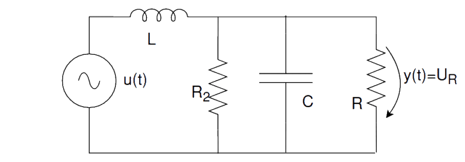

# RLC Circuit Calculator

A web-based calculator for analyzing and visualizing the behavior of RLC (Resistor-Inductor-Capacitor) circuits. This tool allows engineers, students, and electronics enthusiasts to perform circuit calculations directly in their browser.

Try the calculator online: [https://gitmanik.github.io/rlc-circuit-calculator/](https://gitmanik.github.io/rlc-circuit-calculator/)

## Features

- Calculate key parameters for RLC circuits
- Interactive interface for real-time calculations
- Visual representation of circuit configuration
- Support for both series and parallel RLC circuits
- Client-side calculations (no server required)
- Responsive design for desktop and mobile devices

## Usage

1. Input your circuit parameters (resistance, inductance, capacitance)
2. Choose input function (Heaviside, Square, Harmonic, Triangle) and input amplitude and frequency
3. View calculation results updated in real-time

## Libraries used
- [Micromodal](https://github.com/micromodal/Micromodal)
- [Plotly.js](https://plotly.com/)
- [math.js](https://mathjs.org/)
   
## Developed by

- [Paweł Reich (Gitmanik)](https://github.com/Gitmanik)
- [Michał Sojka (akjosturtle)](https://github.com/akjosturtle)
